# WayPoint by [Team Name]

**Team:** Thim Yee Song, Duncan Oh Si Xun, Chong Bing Heng, Kho Wei Jie

**Problem Statement:** Travel Planner

**Video Presentation:** https://youtu.be/wjObWcz9PDI

**Presentation Slides:** https://www.canva.com/design/DAHU911Z80g/61R6on9AFeK1hl8JAPxzhQ/view

**Repository:** https://github.com/Char0093/codenection

---

## 1. Project Overview

### The Problem

Group travel planning fails for reasons that are social, not technical.

**Causes.** A trip has one itinerary but many people with incompatible inputs: different budgets, different interests, different energy levels, and — critically — different *non-negotiable* requirements such as halal food, a severe nut allergy, wheelchair access, or a prayer-space need. These inputs arrive scattered across a group chat, get reconciled manually by whoever volunteered to organise, and are re-litigated every time one thing changes. Three failures recur:

1. **The organiser carries everything.** One person becomes a human database of everyone else's constraints and preferences.
2. **Quiet members get overwritten.** The loudest or fastest voice sets the plan; a majority vote repeatedly disadvantages the same minority.
3. **Confidence is mistaken for verification.** An AI (or a review, or a cuisine label) will happily assert a restaurant is halal or allergy-safe. For a severe constraint, a plausible answer is not an acceptable answer.

**Stakeholders.**

| Stakeholder | What they need | What they get today |
| --- | --- | --- |
| Planner-organiser | One shared, current plan | Reconciles the same decisions across chat, spreadsheets and screenshots |
| Safety-critical traveller | Halal, allergen, mobility or access requirements honoured | Must personally re-verify every venue; cannot trust a generated answer |
| Budget-conscious member | A personal or daily spending cap | Group choices silently exceed their limit; raising it is socially awkward |
| Specialist explorer | Photography, heritage, food or nature time | Either compromises continuously or splits off with no coordination |

**Existing solutions and why they fall short.**

| Existing app | What it does well | Where it falls short for this problem |
| --- | --- | --- |
| **Wanderlog** | Genuinely collaborative — shared itinerary, map, notes, expenses | It is a shared *document*, not a decision system. It stores what the group already agreed on; it does not detect that a chosen restaurant breaks a member's confirmed constraint, does not resolve who compromises, and does not check that the day is physically feasible. |
| **TripIt** | Excellent at consolidating bookings from confirmation emails | Organises a trip *after* it is decided. It has no role in the part that actually hurts: deciding. |
| **Google Maps saved lists / Google Travel** | Best-in-class place data and directions | Single-user by design. A shared list has no owner of a constraint, no notion of duration or conflict, and no timeline. |
| **AI itinerary generators (Layla, Mindtrip and similar)** | Produce a plausible full itinerary in one prompt | Optimise for the one person typing. The output is static — one change makes it stale — and the model is the final authority, so an unverified halal or allergen claim reaches the user as a confident fact. |

The common gap: every one of these treats the plan as **content**. Our group problem needs it treated as a **decision with rules, owners and evidence**.

### Our Solution

WayPoint is a collaborative travel-planning web app that turns a group's conflicting preferences, budgets, schedules and safety requirements into one editable, shared itinerary. AI proposes; deterministic code validates; a human confirms — and those three roles are architecturally separated, so a model can never activate a plan or override a confirmed constraint. The group works in a single workspace that holds the chat, the AI proposals and a Google Calendar-style day timeline at once, so a decision and the conversation around it never drift apart. When safety evidence for a venue is missing, the system says so rather than inventing it.

**Feature set**

- **Typed safety vault** — members record constraints as typed flags (dietary, religious access, mobility), not as free text, so no one has to disclose a medical history in a group chat.
- **Deterministic hard-constraint gate** — every AI proposal and every manual placement is checked against each member's confirmed constraints before it can be accepted. Unknown evidence for a severe constraint *fails closed*.
- **Grounded AI proposals** — Gemini drafts itineraries and change suggestions, but receives only bounded trip context, has no database access, and its output stays a *pending proposal* until an authorised member accepts it.
- **Single-day drag-and-drop timeline** — one 24-hour day at a time; block height equals visit duration; 15-minute resize; opening-hours, overlap, midnight-boundary and locked-reservation checks run before an edit is accepted.
- **Categorised POI choice pool** — Food, Nature, Shopping, Heritage, Culture, Entertainment, Local Wildcard — each card carrying description, source link, cost tier, estimated duration and an explicit safety/trust status.
- **Jigsaw fairness engine** — resolves preference conflicts by minimax regret (shrink the *worst* member's gap) rather than majority vote, with anchor locking, Pareto substitution, fair-turn placement and split-and-merge suggestions.
- **Trip group chat with an addressable assistant** — append-only, trip-scoped, realtime; the assistant is explicitly invoked and produces proposal cards, never silent writes.
- **Decisions feed** — material changes surface as reviewable decision cards the group can agree, disagree or rate, so the plan's history is legible.
- **Route map view** — the selected day's stops routed and drawn on a real interactive map (Google Directions) with a turn-by-turn panel, degrading to a stylised canvas when no key is configured.
- **Row-Level-Security trip isolation** — Supabase RLS enforces membership at the database, in addition to application checks; private preference fields are never returned to other members.

---

## 2. Ideation & Process

### 2.1 Ideas We Considered

Framing question: **How might a group create a trip that respects individual needs without making one person manually arbitrate every decision?**

Chosen directions first, then the ideas we tried and cut. The rapid-ideation and graveyard rows come off our ideation board (section 2.2).

| Idea | Why it was kept / dropped |
| --- | --- |
| **A (Chosen) — Collaborative adaptive workspace** | Kept as the core product. The only direction that makes preferences, alternatives and schedule changes *visible to the whole group* rather than resolving them inside one person's head or inside a model. More complex to build, but it addresses the actual problem. |
| **B (Chosen) — Magnetic single-day timeline** | Kept. An earlier multi-day "draggable wishes" board was too abstract. One 24-hour day, block height as duration, snapping grid and visual collision alerts turns negotiation into a puzzle you can see — feasibility (travel time, opening hours, over-packing) becomes readable at a glance. |
| **C (Chosen) — Hard-constraint gate** | Kept, and it is our moat. A deterministic layer that blocks any venue — including a hallucinated one — that fails a confirmed dietary, religious-access or mobility rule. This is the piece no competitor has. |
| **D (Chosen) — Split & reconverge** | Kept. Bifurcates the group into tailored sub-branches during the afternoon and converges on a shared dinner anchor, instead of forcing 24 hours of togetherness or an uncoordinated split. |
| **E (Chosen) — Hybrid survey + chat preference model** | Kept. A compact survey establishes stable preferences and *confirmed* hard constraints; chat yields temporary, explainable signals (`live_jazz`, `indoor_today`, `quiet_evening`). Chat signals never silently overwrite survey answers, and a possible hard constraint found in chat becomes a Confirm / Edit / Reject card for the affected member. |
| **F (Chosen) — Two-layer place data: owned catalog + live provider discovery** | Kept. A small reviewed catalog carries provenance and safety fields; Google Places API (New) supplies worldwide candidates and hours. Provider results stay visibly distinct from owned safety evidence. |
| **G — Travel MBTI / personality quiz** | Dropped. Gimmicky. Real constraints — allergies, budgets, mobility — are facts, not personality types, and dressing them up as a quiz would have encouraged us to treat them as soft. |
| **H — Budget bidding war** | Dropped. Created toxic gamification: students felt outspent by working peers. It made an existing asymmetry into a visible contest. |
| **I — WhatsApp auto-vote bot** | Dropped. Notification spam created high cognitive load and got muted almost immediately in testing. |
| **J — Anonymous veto buttons** | Dropped. Anonymous vetoes bred social paranoia in friend groups — "who killed my cafe idea?". Transparent split-and-merge turned out to be far healthier than covert vetoes. |
| **K — Fully autonomous AI bookings** | Dropped. Letting an agent unilaterally lock reservations produced real anxiety in discussion. What people wanted was stated almost exactly: *AI drafts, deterministic code verifies, the group approves.* That sentence became our architecture. |
| **L — Majority-vote conflict resolution** | Dropped. Simple, but it structurally punishes the same quiet minority every time. Replaced by progressive escalation and minimax-regret fairness. |
| **M — Telegram bot + Mini App** | Built, then **deleted**. This was our actual v0. Distribution was excellent, but mentor session 1 named three faults we could not answer: every action required typing a long message, sending whole chat logs to the model was expensive and slow, and a text reply gives the group nothing to click. We removed the bot entirely and rebuilt as a web app with structured controls. See section 2.3. |
| **N — Chatbot-only planner** | Dropped as the whole product, for the same reasons as M. Kept as a *component* — the addressable in-workspace assistant. |
| **O — Static one-shot AI itinerary** | Dropped. Clear output and simple architecture, but it goes stale after the first change and hides *whose* needs were compromised to produce it. |
| **P — Survey-only planner** | Dropped as the whole product. Explicit and predictable, but heavy onboarding and blind to desires that appear mid-trip. Its explicit-constraint half survives in idea E. |
| **Q — Chat-only preference extraction** | Dropped as an *authority*. Low friction, but inference is unacceptable as the source of truth for an allergy or a halal requirement. Kept as a *signal* source in idea E. |
| **R — Manually maintained global POI database** | Dropped. Maximum field control, but worldwide coverage and current opening hours are impossible for a four-person team to maintain. Superseded by idea F. |
| **S — Video link scraper (TikTok / IG reels → coordinates)** | Deferred to phase 2. Genuinely novel for discovery, but it is a data-ingestion project competing with core planning logic for the same hours. |
| **T — Rain self-healing** | On the roadmap. Precipitation above 70% auto-triggers indoor swaps. The prototype ships a *Simulate rain* control that demonstrates the swap; the live weather API is not wired up. |
| **U — Mobile-first native Android app** | Deferred, not discarded. Better on-trip, but it duplicates product risk before the planning workflow and API contracts are stable. A Kotlin/Compose companion consuming the same versioned APIs stays conditional on a stable web release. |
| **V — Python optimisation service (OR-Tools)** | Deferred. Real value for knapsack selection and routing, but not until the request/response contracts stop moving. |
| **W — Live maps and route matrices in v1** | Partially pulled forward. Full route matrices deferred; the day route map view shipped. |

### 2.2 Ideation Boards

**Interactive board:** [`docs/ideation.html`](docs/ideation.html) — open it locally, or live at **`/ideation.html`** on the deployment once published. Use the **Design Thinking Canvas** tab (or append `?tab=thinking`) for the brainstorming journey below; the **Spots & Ideas** tab is the working board where the team dropped candidate places, voted, filtered by halal / nut-safe / budget, and staged them into a timeline queue.

The board is deliberately messy — it is what our brainstorming actually looked like, including the ideas we killed. Static captures of each section follow, so reviewers do not have to run anything.

#### 1. The "5 Whys" root cause chain

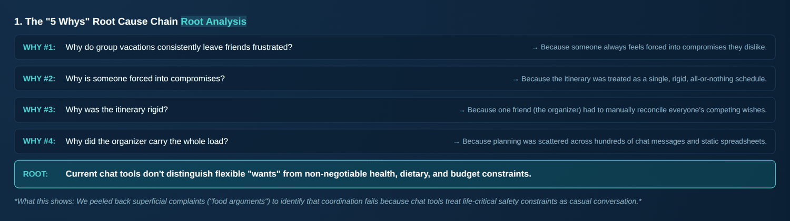

Peeling back the superficial complaint ("we argued about food") four times to reach the real one: **chat tools don't distinguish flexible wants from non-negotiable health, dietary and budget constraints.** Everything else in the product is downstream of that sentence. Our mentor reached the same root independently in session 1.

#### 2. Problem tree: the anatomy of vacation conflict

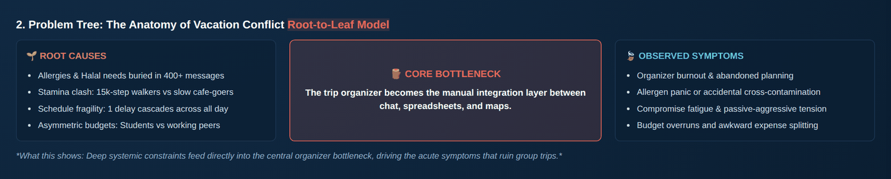

Root causes (allergies buried in 400+ messages, stamina clash, schedule fragility, asymmetric budgets) feed one core bottleneck — **the organiser becomes the manual integration layer between chat, spreadsheets and maps** — which produces the symptoms that actually ruin trips: burnout, allergen panic, compromise fatigue, budget overruns.

#### 3. Raw brainstorming and affinity clustering

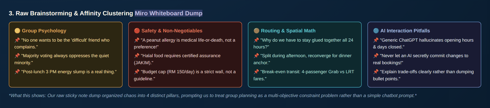

The unfiltered sticky-note dump, clustered into four pillars: group psychology, safety non-negotiables, routing and spatial maths, and AI interaction pitfalls. Clustering is what told us this was a **multi-objective constraint problem**, not a chatbot prompt. Two notes did a lot of work: *"a peanut allergy is medical life-or-death, not a preference"* and *"never let an AI secretly commit changes to real bookings"*.

#### 4. "Crazy Eights" rapid ideation

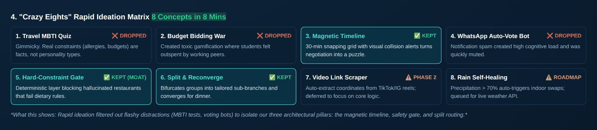

Eight concepts in eight minutes, then a hard filter. Three survived and became the architecture — **magnetic timeline**, **hard-constraint gate** (marked as our moat), **split & reconverge**. Two were deferred (video link scraper, rain self-healing) and three were dropped outright: the MBTI quiz, the budget bidding war, and the auto-vote bot.

#### 5. The idea graveyard

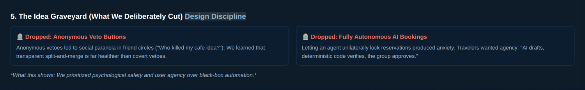

The two cuts we think say the most about our judgement. **Anonymous veto buttons** were dropped because anonymity bred paranoia in friend groups. **Fully autonomous AI bookings** were dropped because unilateral agent action made people anxious — and the alternative they described became our design rule: *AI drafts, deterministic code verifies, the group approves.* We chose psychological safety and user agency over black-box automation.

#### 6. Final solution flow: 3-tier decision authority

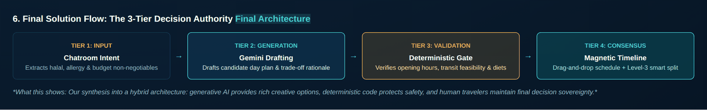

The synthesis. Intent extraction → Gemini drafting → deterministic gate → magnetic timeline with smart split. Generative AI supplies creative options, deterministic code protects safety, humans keep final decision sovereignty.

#### The working spots board

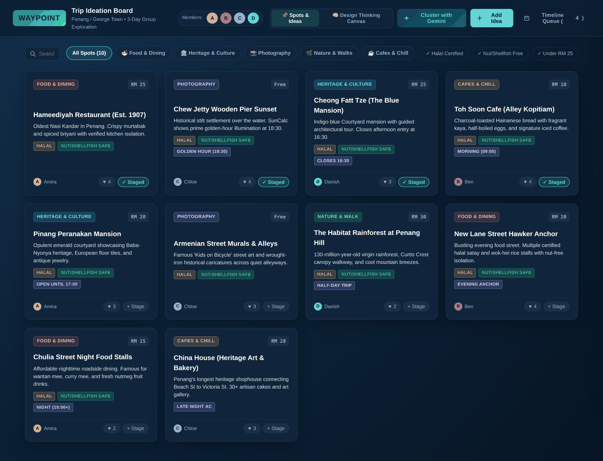

The other tab: candidate places with category, cost and proposer, plus safety filters (halal certified, nut/shellfish free, under RM 25) and a Gemini clustering pass that groups spots spatially and flags timing conflicts — here, a clash between the Chew Jetty sunset at 18:30 and the Blue Mansion tour at 16:30, with a split recommended.

---

The three diagrams below were drawn separately from the board, to work through decisions it does not cover.

**The pivot, before and after.** Our v0 was a Telegram bot. Mentor session 1 took it apart; this is the redesign we drew in response. Each dotted arrow is a friction point the mentor named; each right-hand box is what replaced it.

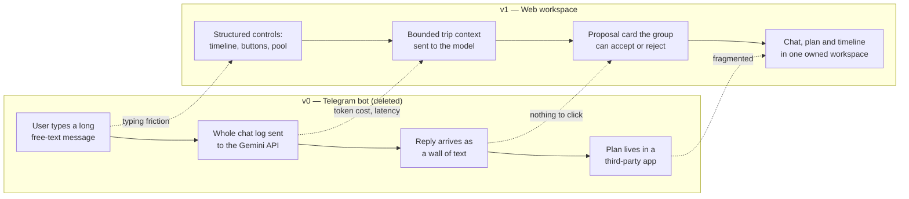

**User flow, main planning path.** Drawn to find where a decision could go wrong. The two diamonds are where the product earns its keep: the gate, and human confirmation.

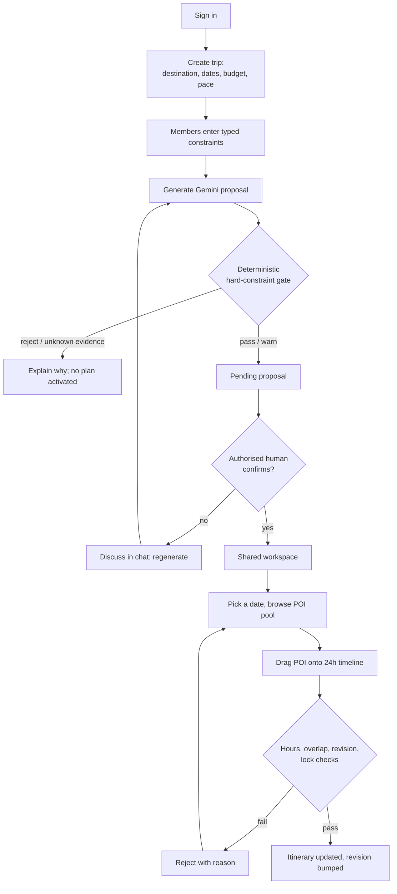

**Place-data strategy.** How a destination we have never seen becomes a safe, schedulable choice without us maintaining a global database.

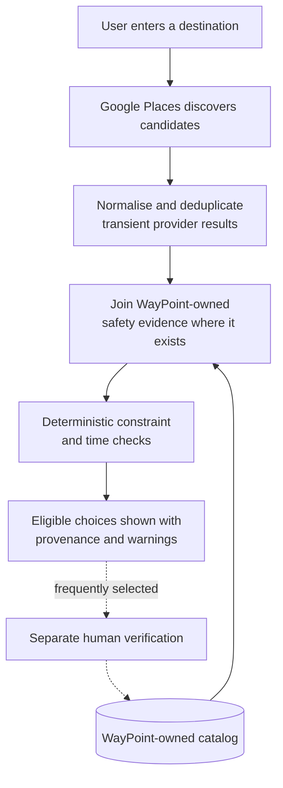

**Decision matrix.** Relative design scores, 1 (weak) to 5 (strong) — the team's own evaluations used to justify a direction, not results from a completed user study.

| Direction | Group coordination | Safety control | Adaptability | Prototype feasibility | Total |
| --- | ---: | ---: | ---: | ---: | ---: |
| Telegram bot (v0) | 2 | 1 | 2 | 5 | 10 |
| Chatbot only | 2 | 1 | 3 | 5 | 11 |
| Static AI itinerary | 2 | 2 | 2 | 5 | 11 |
| Survey-driven planner | 3 | 4 | 2 | 4 | 13 |
| **Collaborative adaptive workspace** | **5** | **5** | **5** | **3** | **18** |


### 2.3 Mentor Consultation

Full write-up: **[Mentorship Feedback & Architectural Changes](https://docs.google.com/document/d/13ezTUJZDujqDdorQaqB603d7R8AQThYS/edit?usp=sharing&ouid=102935557049375493537&rtpof=true&sd=true)**

We had two structured mentoring sessions in September 2026. Session 1 caused the largest change in the project's direction: we deleted the Telegram bot entirely and rebuilt as a web application.

| Date | Mentor | Feedback Received | What Was Changed |
| --- | --- | --- | --- |
| 04/09/2026 | Session 1 mentor | **Messaging friction.** Relying on Telegram requires users to type long text messages repeatedly, causing severe friction. | Accepted in full. We deleted the Telegram bot and rebuilt the product as a web application with structured controls — a drag-and-drop timeline, a categorised choice pool, preference buttons — so the common actions are a click, not a sentence. |
| 04/09/2026 | Session 1 mentor | **API inefficiency.** Sending full chat logs to the Gemini API creates excessive tokens, driving up cost and latency. | Accepted. The model now receives bounded, structured trip context instead of a transcript. This also turned out to be a security improvement, not just a cost one: a bounded context is what let us stop treating the prompt as a trust boundary. |
| 04/09/2026 | Session 1 mentor | **Core insight on group dynamics.** The primary emotional pain point in group travel is friends arguing over conflicting desires. | Accepted, and it became the thesis of the product. We had been building a better itinerary *generator*; we changed the target to conflict resolution and built the jigsaw fairness engine (minimax regret, fair-turn placement, split-and-merge) around this sentence. |
| 04/09/2026 | Session 1 mentor | **Recommendation.** Move to a web application with structured controls such as timeline selectors, preference buttons and shared maps. | Accepted. This is the architecture we shipped: Next.js web app, day timeline, preference screens, and a day route map view. |
| 09/09/2026 | Session 2 mentor | **UI consolidation** into a unified, cohesive workspace. | Accepted. Chat, Plan, Timeline, Decisions and Map became tabs of one trip shell with a shared sidebar, rather than separate pages the user navigates between. |
| 09/09/2026 | Session 2 mentor | **Visual enrichment** — show photos of places, exact addresses and opening hours. | Partially adopted. Addresses, opening hours, descriptions, cost tier and source links are in the POI detail sheet, and opening hours are enforced as a scheduling constraint rather than shown as decoration. Photos are **not** in yet: provider image terms and attribution need handling, and we chose to spend the remaining time on the safety gate instead. This is the top item in our visual backlog. |
| 09/09/2026 | Session 2 mentor | **Real-world integration** — a Google Calendar bridge connects planning with execution. | Deferred, deliberately. We agree it is valuable, but a calendar export is only meaningful once the itinerary is stable and timezone-resolved, and our activity times are currently destination-local wall-clock values. Exporting a plan that can silently shift by hours would be worse than not exporting it. Scheduled after timezone resolution. |
| 09/09/2026 | Session 2 mentor | **Constraint handling** — distinguish non-negotiable anchors while dynamically reordering leisure stops. | Accepted, and it shaped the timeline directly. Fixed reservations are locked blocks that require an explicit unlock, while ordinary blocks move freely — and the jigsaw engine's first step is anchor partitioning, which is this feedback expressed as an algorithm. |

---

## 3. Design & Prototype

**UI Prototype (live):** https://codenection-fty1.vercel.app/login

**Demo account for reviewers**

| Field | Value |
| --- | --- |
| Email | `dev_test@gmail.com` |
| Password | `c35_D877363` |

> Opens in an incognito window. Sign in with the account above — it is a disposable demo account created for judging and holds no real user data. The deployment runs in **prototype mode**: a George Town, Penang sample trip on fixed data, so you can click through the full flow without setting anything up. Changes reset on refresh.

### Key screens

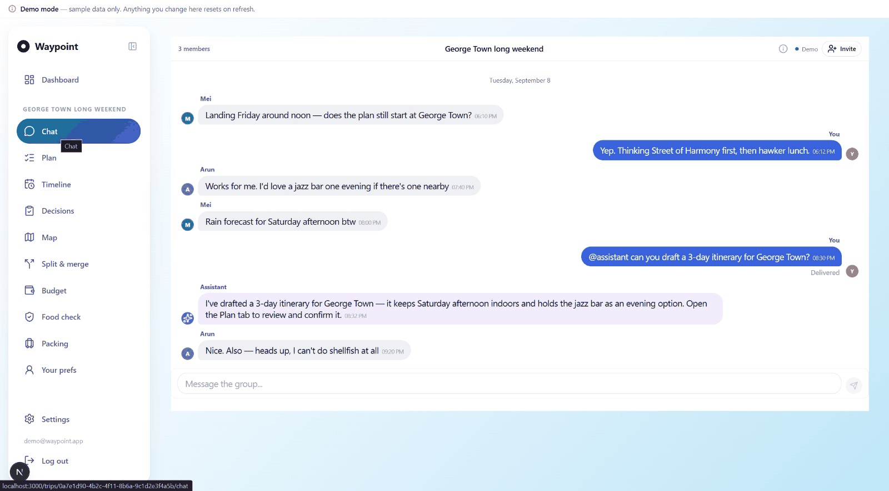

**Trip chat with an addressable assistant.** The whole group is in one thread — Mei confirms her landing time, Arun asks for a jazz bar, Mei flags Saturday rain. The assistant is *addressed* (`@assistant`), not ambient, and it answers with what it did and where to review it: it drafted a three-day itinerary, kept Saturday afternoon indoors because of the rain, and held the jazz bar as an evening option — then pointed at the Plan tab to confirm. It did not touch the itinerary itself. The last message is the one that matters most: Arun says "I can't do shellfish at all". In a normal group chat that sentence scrolls away. Here it becomes a confirmable typed constraint that every later suggestion is checked against.

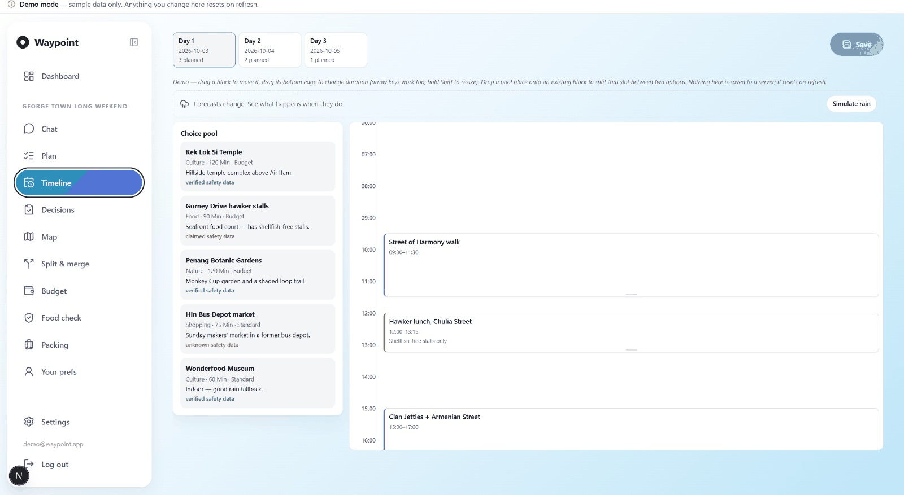

**Single-day timeline builder.** Day tabs across the top, one 24-hour day below. Drag a place from the choice pool into a slot; drag the bottom edge to change duration; arrow keys and Shift-resize work too, and dropping a pool place onto an existing block splits that slot between two options. Block height *is* the visit duration, so an over-packed day looks over-packed.

Two things in this screen carry the product's argument. First, every pool card states its evidence level — Kek Lok Si Temple and Penang Botanic Gardens are **verified safety data**, Gurney Drive hawker stalls is only **claimed**, and Hin Bus Depot market is **unknown**. The catalog models four levels — `verified`, `claimed`, `unknown` and `no` — three of which are visible here, and the gate treats each differently rather than collapsing them into one boolean. Second, Arun's shellfish constraint from the chat has already propagated: the 12:00 hawker lunch block is annotated *"Shellfish-free stalls only"* without anyone re-typing it. The **Simulate rain** control re-runs the day against a changed forecast so you can watch indoor fallbacks like the Wonderfood Museum surface.

The left sidebar is the rest of the workspace: Dashboard, Chat, Plan, Timeline, Decisions, Map, Split & merge, Budget, Food check, Packing and Your prefs.

> _[Optional: add screenshots of Decisions, Split & merge, Food check and the Map view — the captions above cover the two screens that carry the core argument.]_

---

## 4. What Makes It Different

Novel features, and what the twist is in each:

1. **A deterministic gate that fails closed on unknown safety evidence.** Not "the AI tries to respect your allergy" — a separate, testable code path evaluates each member's *confirmed* constraints against owned POI safety fields, and when the evidence is absent it refuses rather than assuming. Original twist: most products treat missing data as permissive; we treat it as blocking, and we distinguish `verified` / `claimed` / `unknown` / `no` halal status rather than collapsing them into one boolean.

2. **AI as a proposer with no write authority.** Gemini receives bounded trip context, has no database tools, and its structured output is Zod-validated and independently re-resolved against our own catalog before anything is shown. The twist: the prompt is deliberately *not* a trust boundary — improving prompt wording can improve suggestion quality without ever being able to widen what the system permits.

3. **Minimax-regret fairness instead of majority vote.** The jigsaw engine minimises the largest gap between what any single member would ideally get and what the shared plan gives them. The twist: it optimises for the worst-off member rather than the group total, which is what stops the same quiet person losing every vote.

4. **Progressive conflict escalation.** Conflicts run through four stages — lock genuine fixed commitments → search for a Pareto-improving substitution → offer each member a fair turn to place a high-value activity → suggest a micro-split or a strategic split that reconverges at a shared anchor. The twist: splitting up is treated as a *legitimate, coordinated outcome* with a reconvergence point, not as a failure of the planner.

5. **Survey and chat as different *kinds* of truth.** The survey produces durable preferences and confirmed hard constraints; chat produces expiring, explainable discovery signals. The twist: a possible hard constraint detected in chat is inert until the affected member confirms it via a Confirm / Edit / Reject card — inference can suggest, but never assert, a safety fact.

6. **Typed constraints as a privacy feature.** Safety requirements are enum flags, not prose, and free-text validation actively rejects common sensitive disclosures. The twist: the schema itself is what lets a member participate safely without telling four friends about a medical condition — and RLS means private preference fields are usable in aggregate scoring without being readable by other members.

7. **Duration-as-geometry scheduling with real feasibility checks.** Block height *is* the visit duration on a 24-hour day, and every edit is validated against opening hours, overlaps, midnight boundaries, locked reservations and a revision counter. The twist: opening hours are treated as feasibility, not decoration — and when hours are unknown the UI says "unverified" instead of implying the venue is open.

**Comparison with the solutions named in section 1** _(optional table, included for clarity)_

| Capability | Wanderlog | TripIt | Google Maps lists | AI itinerary generators | **WayPoint** |
| --- | :---: | :---: | :---: | :---: | :---: |
| Shared, collaborative plan | Yes | Partial | Partial | No | Yes |
| Per-member typed hard constraints | No | No | No | No | Yes |
| Deterministic safety check, independent of the AI | No | No | No | No | Yes |
| Fails closed on unknown safety evidence | No | No | No | No | Yes |
| Structured conflict resolution beyond a vote | No | No | No | No | Yes |
| AI suggestions inside the workspace | Partial | No | No | Yes | Yes |
| AI blocked from activating a plan | n/a | n/a | n/a | No | Yes |
| Duration-aware day timeline with feasibility checks | Partial | No | No | Partial | Yes |

**Yes** full support  |  **Partial** limited or indirect support  |  **No** not supported

---

## 5. Technical Architecture & Feasibility

### Tech stack

| Layer | Choice | Why we chose it | Constraints we expect |
| --- | --- | --- | --- |
| **Frontend** | Next.js 15 (App Router), React 19, TypeScript | One framework for UI *and* API routes, so the domain rules and the interface ship together while the contracts are still moving. Server Components keep the Gemini and service keys off the client by construction. | React 19 + Next 15 is a recent pairing; some libraries lag. We write our own responsive CSS (no UI kit) which costs time but avoids fighting a design system. |
| **Styling / icons** | Hand-written responsive CSS, Lucide React | No Tailwind/MUI dependency to learn or fight; full control over the timeline's pixel geometry, which a component library would make harder. | More CSS to maintain by hand; consistency is a discipline problem, not an enforced one. |
| **Backend / orchestration** | Next.js Route Handlers + server actions | Keeps the AI boundary, the gate and the repositories in one deployable unit. Every mutation passes through a typed server boundary. | Not a long-running worker: anything slow (optimisation, batch provider fetch) needs to move to a separate service — which is exactly why the Python service is scoped out of v1. |
| **Validation** | Zod at every API and model boundary | The AI's output is untrusted input. Zod is what turns "Gemini returned some JSON" into a typed value or a rejection, with no middle state. | Schema drift between DB, API and model types must be maintained by hand. |
| **Database / Auth** | Supabase — PostgreSQL, Auth, Row Level Security, Realtime, PostGIS, pgvector | Free tier, and RLS lets trip isolation be enforced *in the database* rather than only in application code — important when the claim is "a member cannot read another member's private preferences". PostGIS and pgvector are already there for geo queries and interest vectors, so no second datastore. | Free-tier limits and cold starts; realtime connection caps. A service-role key must never reach the runtime client — it is used only by explicit seed scripts. Complex multi-table authorisation pushes logic into SQL security-definer functions, which are harder to test than TypeScript. |
| **AI** | Google Gemini via the server-only `@google/genai` client | Strong structured-JSON output, generous free tier for a hackathon, and same-vendor coherence with Places/Maps. Kept server-only so the key is never in the browser. | Latency on longer itineraries; non-determinism means we test the *gate*, not the model. Rate limits on the free tier constrain live demo retries. Model output is never trusted — it is re-resolved against our own catalog. |
| **Place data** | Google Places API (New) — *planned*; 24 reviewed seed POIs today | We cannot maintain a worldwide POI database as a four-person team. One provider family for places/maps/routes keeps attribution and content-policy boundaries understandable. | Billing and quota; caching restricted by provider terms; provider content must stay visibly separate from our owned safety evidence. Reviews and cuisine labels are *not* halal/allergen proof. |
| **Maps / routing** | Google Maps JavaScript API + Directions API (day route view); Routes API *planned* | Best coverage for Malaysian POIs and a generous monthly free credit. | The browser key is public, so it is restricted by HTTP referrer; Places/Routes use a separate server-only key. Enabling the key also widens the CSP to Google-owned hosts (never a wildcard). Without a key, the map degrades to a fallback canvas rather than breaking. |
| **Optimisation** | Python 3.12 + FastAPI + OR-Tools — *planned, out of v1 scope* | Knapsack selection and split-and-merge routing are genuinely a solver problem, not a TypeScript problem. | Deliberately deferred: a second service is only worth deploying once the request/response contract stops changing. Must be stateless and receive anonymised input. |
| **Testing** | Vitest, Testing Library, PGlite (in-process Postgres), Playwright | PGlite lets RLS and migration behaviour be tested in CI with no hosted secrets — the security claims are testable offline. Playwright covers the drag-and-drop timeline, which unit tests cannot. | Playwright runs against mocked HTTP, so hosted Supabase + real Gemini still needs a manual acceptance pass. |
| **CI** | GitHub Actions — lint, typecheck, test, build on push and PR | Catches the four-way merge problems a hackathon team creates. | Cannot run hosted integration without putting secrets in CI, which we chose not to do. |
| **Hosting** | Vercel for the Next.js app; Supabase cloud for the database | Zero-config Next.js deploys with preview URLs per branch — useful for showing mentors a change. Both free tiers. | Serverless function timeouts cap long AI calls; region choice matters for latency to a Malaysian audience. A `NEXT_PUBLIC_PROTOTYPE=1` build runs on fixtures with no backend, for a guaranteed-working demo deploy. |

### System architecture

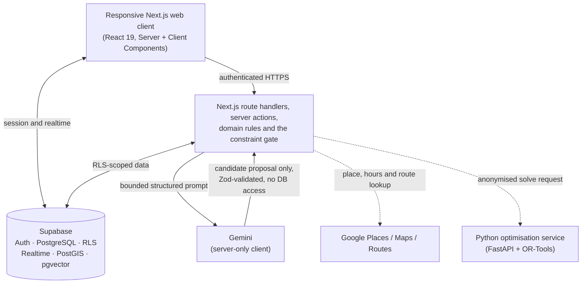

Solid lines are the current implementation. Dotted lines are planned integrations. Note that Gemini's only edge is a *return* edge into the application layer — it has no path to the database.

### Build plan & scope

**In scope for the building phase** — the smallest set that demonstrates the thesis end to end:

1. Apply the latest migration and seed to a hosted Supabase project and verify the full authenticated path: create trip → enter constraints → generate proposal → gate → confirm → edit timeline → reload.
2. Complete the compact preference survey and the editable preferences screen, including preferred daily start/finish times before generation.
3. Surface gate `warn` results and unverified-hours warnings consistently in every proposal and placement interface (currently inconsistent).
4. Add a small set of high-confidence opening-hours fixtures for the demo corridor so the hours-validation path is demonstrable, not just implemented.
5. Connect the jigsaw engine to survey-derived member weights so the fairness engine runs on real preferences rather than UI-level defaults.
6. Harden the demo: prototype-mode fixture build as a fallback, a seeded reference trip, and a clean-browser rehearsal.

**Explicitly out of scope for this phase** — deferred on purpose, listed so the scope reads as a decision rather than an omission:

- Live Google Places discovery for arbitrary worldwide destinations (the owned catalog covers three Malaysian corridors: KLCC, Bukit Bintang, Old Town/Melaka).
- The Python optimisation service, Redis coordination and budget-aware solving.
- Travel-time blocks between activities and full Routes API integration.
- Weather-triggered replanning, packing assistance, on-site visual Q&A.
- Presence cursors, offline/PWA snapshots.
- The Kotlin/Jetpack Compose Android companion — conditional on one stable web API release and demonstrated mobile demand.

### Current implementation status

Status reflects the repository, not the plan. "Partial" means a usable slice exists with one or more planned capabilities unconnected.

| Area | Status | Evidence / limitation |
| --- | --- | --- |
| Authentication and trip CRUD | Implemented | Magic-link sign-in, dev-only password sign-in, authenticated trip operations |
| Gemini itinerary proposals | Implemented | Structured JSON, Zod validation, pending proposals, owner decision flow |
| Typed constraints (safety vault) | Implemented | Dietary / religious-access / mobility enum schema with RLS |
| Deterministic hard-constraint gate | Implemented | Applied to both Gemini proposals and manual POI placement |
| POI grounding | Implemented, seed corridors only | Name resolution + constraint-aware candidate hints; no provider adapter yet |
| POI catalog | Partial | 24 sourced records with provenance and safety fields |
| Single-day timeline | Implemented | Date switching, schedule/unschedule, move, resize, locked reservations |
| Opening-hours validation | Partial | Normalisation and server-side checks exist; most seed rows lack live hours |
| Group chat | Implemented | Trip-scoped persistence, optimistic send, realtime transport |
| Embedded AI assistant + proposal cards | Partial | Addressed assistant and cards exist; hosted adversarial verification outstanding |
| Decisions feed | Implemented (prototype) | Decision cards with agree/disagree and rating |
| Day route map | Implemented (prototype) | Google Directions routing with a stylised fallback when no key is set |
| Jigsaw conflict engine | Partial | Core algorithms and UI exist; survey-derived weights outstanding |
| Preference survey and editor | Not implemented | Designed; in scope for the building phase |
| Chat preference extraction | Not implemented | Planned as expiring, explainable, confirmation-gated signals |
| Live provider discovery / travel-time routing | Not implemented | Roadmap |
| Python optimisation service | Not implemented | Roadmap |
| Android companion | Deferred | Conditional on a stable web API release |

### Honest limitations

- The reviewed catalog covers three Malaysian corridors (KLCC, Bukit Bintang, Old Town/Melaka) and the hosted prototype-mode demo runs a separate fixed George Town, Penang trip; any other destination returns an empty pool rather than fabricated places.
- Provider opening hours are usually unavailable, so the interface often has to show an unverified-hours warning — the honest path, but a visibly incomplete one.
- `claimed` halal status is not authoritative verification, and we present it as such.
- Budget and mobility gate logic exists, but real per-leg distance and numeric activity pricing are not yet connected.
- Browser tests use mocked HTTP; a hosted Supabase + Gemini end-to-end pass is a separate manual gate.
- Activity times are destination-local wall-clock values; notifications need timezone resolution first.

---

## Appendix — Running the prototype

### Prerequisites

Node.js compatible with the project dependencies, a disposable Supabase project, and a Gemini API key.

### Install

```bash
npm install
cp .env.example .env   # PowerShell: copy .env.example .env
```

Configure `.env`:

```dotenv
NEXT_PUBLIC_SUPABASE_URL=https://your-project.supabase.co
NEXT_PUBLIC_SUPABASE_ANON_KEY=your-anon-key
GEMINI_API_KEY=your-server-only-key
GEMINI_MODEL=gemini-3.7-flash
NEXT_PUBLIC_GOOGLE_MAPS_KEY=          # optional, browser-exposed, restrict by HTTP referrer
NEXT_PUBLIC_PROTOTYPE=                # set to 1 to run on fixtures with no backend
```

Never expose the Gemini key through a `NEXT_PUBLIC_` variable, and never put the Supabase service-role key in the application environment file.

### Database and seed

Apply the SQL files in `supabase/migrations/` in filename order to a disposable project, then seed the reviewed catalog (idempotent):

```bash
SUPABASE_SERVICE_ROLE_KEY=your-service-role-key npm run seed:kl-reference
```

Use **KLCC**, **Bukit Bintang** or **Melaka** as the destination to exercise the POI pool.

### Authentication

Enable email sign-in and set the Supabase Site URL and callback (e.g. `http://localhost:3000/auth/callback`). For repeated local testing the development build offers a password form — create a disposable user:

```bash
SUPABASE_SERVICE_ROLE_KEY=your-service-role-key npm run seed:dev-user -- dev@example.com a-strong-password
```

This form is not rendered in the production build.

### Start

```bash
npm run dev              # full stack
npm run dev:prototype    # fixtures only, no Supabase or Gemini needed
```

### Verification

```bash
npm run lint
npm run typecheck
npm test
npm run test:coverage
npm run build
npx playwright install chromium
npm run test:browser
```

GitHub Actions runs lint, typecheck, tests and the production build on pushes to `main` and on pull requests.

## Appendix — Repository guide

| Path | Purpose |
| --- | --- |
| `app/` | Next.js routes, pages and API handlers |
| `features/` | Workspace, timeline, chat, prototype and marketing components |
| `lib/domain/` | Pure constraint, proposal, itinerary, jigsaw and fairness rules |
| `lib/poi/` | POI choice-pool, opening-hours and placement validation |
| `lib/gemini/` | Structured Gemini client and the planner boundary |
| `lib/repositories/` | Supabase-backed application repositories |
| `supabase/migrations/` | Schema, RLS policies and security-definer functions |
| `scripts/seed_kl_reference.ts` | Reviewed prototype POI seed |
| `tests/` | Domain, API, database (PGlite) and component tests |
| `docs/` | Feature specs, design docs, research and testing notes |
| `docs/screens/` | Submission screenshots referenced from this README |
| `docs/ideation.html` | Interactive team ideation board (also served at `/ideation.html`) |
| `public/ideation.html` | Deployed copy of the ideation board |
| `Implementation_Plan.md` | Detailed engineering roadmap (binding specification) |
| `docs/implementation-status.md` | Point-in-time engineering handoff |

## Submission checklist

- [ ] Team name filled in at the top
- [x] YouTube video link added — confirm the video is no longer than five minutes
- [x] Presentation slides link added — confirm it opens for a logged-out viewer
- [x] UI prototype link and demo account added — re-verify both in an incognito window before submitting
- [x] Section 2.2: ideation board embedded as images and committed as `docs/ideation.html`
- [ ] Confirm `/ideation.html` loads on the deployment after the next deploy
- [x] Section 2.3: mentor consultation table completed and linked to the full write-up
- [x] Section 3: chat and timeline screenshots added to `docs/screens/` (optional: add Decisions, Map, Food check)
- [ ] Latest migration and seed applied to the demo project
- [ ] Demo account and reference trip tested in a clean browser (confirm `dev_test@gmail.com` still signs in)
- [ ] README claims checked against the final commit
- [ ] No credentials beyond the disposable demo account, no private links, no personal medical information committed

