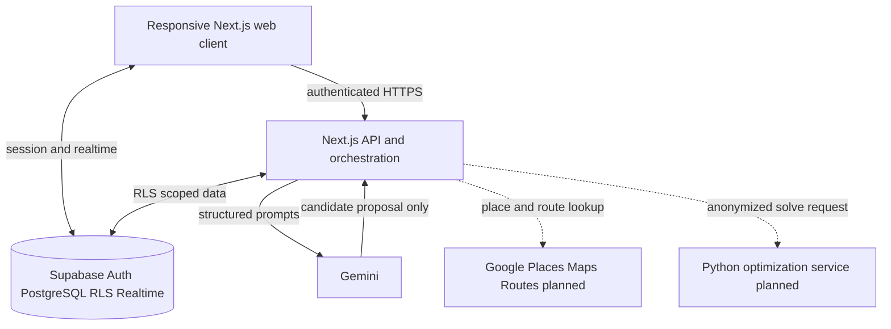

# WanderSync

WanderSync is a collaborative travel-planning web application that helps a group turn different preferences, budgets, schedules and safety requirements into one editable itinerary. Instead of asking an AI to produce a plan that the group must accept as-is, WanderSync combines AI suggestions with deterministic safety checks, a shared single-day timeline and explicit human confirmation.

The current prototype demonstrates authenticated trip planning, group chat, Gemini-generated proposals, safety-aware POI grounding and a calendar-style day builder. The broader vision adds live worldwide place discovery, routing, optimization and adaptive replanning without requiring a manually maintained global location database.

## Submission links

> Complete these links before submission. Judges should not need to search the repository for them.

- **Demo video, maximum 5 minutes:** _Add public video URL_
- **Live application:** _Add deployed application URL_
- **Design or ideation board:** _Add Figma, FigJam or equivalent URL_
- **Repository:** _Add public repository URL if this README is viewed elsewhere_
- **Team members and roles:** _Add names and contributions_

## The problem

Group travel planning is rarely just a search problem. One person wants food, another wants nature, someone has a strict budget, and another may have a severe allergy or religious requirement. These decisions are usually scattered across chat messages and repeatedly reconciled by one organizer.

Most itinerary generators optimize for the person typing the prompt. They can suggest attractive places, but they do not reliably answer four group-level questions:

1. Does the plan respect every member's non-negotiable constraints?
2. Is the plan feasible within the group's available time and the venue's opening hours?
3. What happens when members want incompatible activities?
4. Can the group change the plan without losing the agreed version?

This creates three recurring failures: the organizer carries the coordination burden, quieter members are easy to overlook, and an AI recommendation can appear confident even when important safety data is unknown.

## Who it is for

The reference scenario is a group of friends planning a multi-day city trip in Malaysia.

| Traveler | Need | Current pain |
| --- | --- | --- |
| Planner-organizer | One shared and current plan | Reconciles the same decisions repeatedly across chat and spreadsheets |
| Safety-critical traveler | Halal, allergen, mobility or access requirements | Cannot treat a plausible AI answer as verified evidence |
| Budget-conscious member | Personal or daily spending limit | Group choices can silently exceed an individual's limit |
| Specialist explorer | Photography, heritage, food or nature interests | Must either compromise continuously or split without coordination |

## Our solution

WanderSync gives the group a shared planning workspace:

- A trip begins with destination, dates, pace, budget and members.
- Members can record typed safety requirements rather than exposing medical histories in free text.
- Gemini drafts an itinerary or suggests a change, but cannot activate it.
- A deterministic gate checks confirmed constraints against owned POI safety data.
- Attractions and restaurants appear in a categorized choice pool with descriptions, sources, links, cost tiers and safety status.
- The user selects one date and drags a POI onto a 24-hour timeline. Block height represents visit duration.
- Opening hours, overlaps, midnight boundaries, trip revision and locked reservations are checked before an edit is accepted.
- Group chat, proposals and the timeline remain in the same workspace.
- An authorized human confirms material AI-generated changes.

The prototype intentionally fails closed for confirmed severe constraints when evidence is missing. It is better to explain that a venue cannot yet be verified than to invent safety information.

## Why WanderSync is different

WanderSync separates three kinds of authority:

| Layer | What it may do | What it may not do |
| --- | --- | --- |
| Gemini | Extract possible intent, generate candidates and explain alternatives | Approve a plan, override a constraint or write directly to the database |
| Deterministic application logic | Validate time, safety, authorization, revisions and feasibility | Invent missing place or safety facts |
| Human group | Confirm constraints and accept or reject material changes | Bypass database authorization rules |

This produces a safer and more collaborative pattern than a single prompt followed by a static itinerary. The AI remains useful for interpretation and creativity, while code and human confirmation control decisions that must be dependable.

## Ideation

Ideation was not a single jump to an AI itinerary generator. We explored how much the product should infer, how much users should enter explicitly, how places should be sourced, how disagreements should be resolved and which client should be built first.

### Initial opportunity areas

We began with the broad question: **How might a group create a trip that respects individual needs without making one person manually arbitrate every decision?**

The opportunity was divided into five areas:

| Area | Questions explored |
| --- | --- |
| Preference discovery | Should users complete a survey, should AI learn from chat, or should both be used? |
| Safe recommendations | How can AI suggestions remain useful without treating unverified halal or allergen claims as facts? |
| Collaborative scheduling | How can the duration and timing of each activity be understood and edited visually? |
| Group disagreement | Should the system vote, optimize a compromise, or coordinate temporary splits? |
| Place coverage | Should the team store every destination, search providers on demand, or combine both approaches? |

### Concepts considered

| Concept | Strength | Why it was not selected as the complete solution |
| --- | --- | --- |
| Chatbot-only planner | Fastest interaction and easy to prototype | Produces an answer but gives the group weak control over time, provenance and conflicts |
| Static AI itinerary | Clear output and simple architecture | Becomes stale after one change and can hide whose needs were compromised |
| Survey-only planner | Explicit and predictable preferences | Adds onboarding effort and misses temporary desires expressed during the trip |
| Chat-only preference extraction | Low friction and responsive to new interests | Inference is unsuitable as the authority for allergies, halal needs or other hard constraints |
| Manually maintained global POI database | Maximum control over stored fields | Impossible for a small team to keep worldwide coverage and opening hours current |
| Mobile-first native application | Strong on-trip device experience | Duplicates product risk before the planning workflow and API contracts are stable |
| Collaborative adaptive workspace | Makes preferences, alternatives and schedule changes visible | More complex, but it directly addresses the group problem and was selected |

### Decision matrix

Scores are relative design evaluations from 1, weak, to 5, strong. They document why the team selected the collaborative workspace rather than claiming results from a completed user study.

| Direction | Group coordination | Safety control | Adaptability | Prototype feasibility | Total |
| --- | ---: | ---: | ---: | ---: | ---: |
| Chatbot only | 2 | 1 | 3 | 5 | 11 |
| Static AI itinerary | 2 | 2 | 2 | 5 | 11 |
| Survey-driven planner | 3 | 4 | 2 | 4 | 13 |
| Collaborative adaptive workspace | 5 | 5 | 5 | 3 | **18** |

### How the idea evolved

#### Survey and chat should complement each other

The first question was whether a short survey or chat extraction would better understand a traveler. We chose a hybrid model:

- A compact survey will establish stable preferences and confirmed hard constraints.
- Chat will produce temporary, explainable discovery signals such as `live_jazz`, `indoor_today` or `quiet_evening`.
- Chat-derived signals will never silently overwrite survey answers.
- A possible hard constraint found in chat will become a Confirm, Edit or Reject card for the affected member.
- Users will be allowed to edit their preferences after onboarding. Soft changes affect future suggestions; safety-critical changes trigger a new review.

This preserves low-friction personalization while keeping sensitive decisions explicit.

#### A worldwide product cannot rely on seed data alone

Seed POIs are useful for a controlled prototype because their descriptions, sources and safety fields can be reviewed. They are not the worldwide strategy.

The selected design uses two layers:

1. **WanderSync-owned catalog:** a small set of reviewed records containing provenance and safety-specific fields.
2. **Live provider discovery:** Google Places API (New) will find candidates and retrieve permitted place details and opening hours for new destinations.

Provider results must remain visibly distinct from owned data. A review, cuisine label or AI guess is not proof of halal or allergen safety. Frequently selected destinations can be cached within provider terms and promoted into the owned catalog only after a separate verification process.

#### The web application comes before Android

We selected a responsive web application for the main planning workflow. It is faster to validate with a group and avoids maintaining two interfaces while the domain rules are changing. A later Kotlin and Jetpack Compose Android companion can consume the same versioned APIs after the web flow is stable. The mobile client should focus first on the active itinerary, offline access, chat and on-trip notifications rather than rebuilding the entire planner.

#### One day at a time is clearer than displaying the whole trip

An earlier timeline direction displayed multiple days and emphasized abstract draggable wishes. We changed it to a Google Calendar-style single-day builder:

- The selected date appears above the timeline.
- Only one 24-hour day is displayed at once.
- Users switch dates without losing edits.
- POIs remain in a categorized pool until placed.
- Activity duration controls the height of its block.
- A description and detail view help the group understand a place before scheduling it.

This keeps the immediate planning decision readable on desktop and mobile screens.

#### Opening hours belong to feasibility, not decoration

Opening hours affect where a block may be placed. When reliable hours are available, WanderSync rejects a visit that does not fit inside an open interval. When hours are absent or expired, the prototype shows an unverified-hours warning instead of pretending the place is open. Live acquisition is planned through Google Places; the current seed data mainly demonstrates the unknown-hours path.

#### Conflicts should escalate instead of immediately using majority rule

A vote can repeatedly disadvantage the same person. WanderSync uses a progressive conflict model:

1. Lock genuine fixed commitments.
2. Search for a Pareto-improving substitution that keeps everyone together.
3. Offer each member a fair turn to place a high-value activity.
4. If preferences remain incompatible, suggest a nearby micro-split or a strategic split that reconverges at a shared anchor.

The implemented jigsaw engine uses minimax regret: it reduces the largest gap between what any member could ideally receive and what the shared plan gives them. This is more protective of minority preferences than maximizing only the group's total score.

### Ideas deferred rather than discarded

- Live maps and route matrices were deferred until the timeline and place identity are reliable.
- The Python optimization service was deferred until the request and response contracts are stable.
- Weather-triggered self-healing, photo-light planning, packing assistance and on-site visual questions remain later extensions.
- Android remains conditional on a stable web release and demonstrated user demand.
- A Telegram bot and Mini App direction was retired because the product needs a richer native collaborative workspace.

## User experience

### Main planning flow

1. Sign in and create a trip.
2. Enter the destination, dates, budget, pace and group notes.
3. Add or confirm typed constraints.
4. Generate a Gemini proposal.
5. Review the proposal and any validation outcome.
6. Open the shared workspace.
7. Select a date above the timeline.
8. Browse Food, Nature, Shopping, Heritage, Culture, Entertainment or Local Wildcard POIs.
9. Open a POI's details, source or official link.
10. Drag or click the POI into a valid time slot and resize its duration in 15-minute increments.
11. Move ordinary blocks, return them to the pool, or explicitly unlock a fixed reservation.
12. Discuss alternatives in chat and confirm material proposals.

### Preference changes

The planned preference editor deliberately allows a member to change their answers after the initial survey:

- Soft preference changes apply to future ranking immediately.
- The active itinerary is not silently rewritten.
- The user may request a review of the current itinerary and inspect a proposed diff.
- A newly stricter safety constraint immediately marks affected activities for review.
- Reducing or removing a severe constraint requires explicit confirmation and preserves an audit trail.

### Member conflict resolution

WanderSync distinguishes data conflicts from preference conflicts:

- **Safety conflict:** the deterministic gate wins; the activity is rejected or held for explicit review.
- **Concurrent edit conflict:** revision checks reject the stale write and reload the newest plan.
- **Preference conflict:** the jigsaw engine proposes substitution, fair-turn placement or a split-and-merge alternative.
- **AI disagreement:** AI output remains a pending proposal until an authorized member accepts it.
- **Private preference conflict:** the system may use private values in aggregate scoring without revealing them to other members.

## Prototype highlights

### Single-day POI builder

The day builder pairs a searchable choice pool with one selected date's 24-hour timeline. Cards provide a short description, category, estimated duration, cost tier, safety status, trust level and detail link. Scheduled blocks scale with duration, support 15-minute resizing and use revision-checked writes.

### Safety-aware AI proposals

Gemini receives a constraint-filtered candidate hint, while the application independently resolves the returned activity to the full catalog and runs the deterministic gate. This means prompt wording can improve suggestions without becoming a trust boundary.

### Shared workspace

The trip workspace combines group chat, an explicitly invoked AI assistant, proposal cards and the planning timeline. Chat messages are append-only and trip-scoped. The assistant cannot mutate the active itinerary directly.

### Fairness engine

The jigsaw domain engine implements anchor partitioning, Pareto filling, round-robin veto, split-cut suggestions, magnetic time snapping and minimax-regret evaluation. Some of these mechanics are implemented as domain/UI foundations and are not yet connected to the complete preference survey.

## Architecture



Solid lines represent the current application foundation. Dotted lines represent planned provider and optimization integrations.

### Current stack

- Next.js 15 App Router, React 19 and TypeScript
- Hand-written responsive CSS and Lucide icons
- Supabase Auth, PostgreSQL, Row Level Security, Realtime, PostGIS and pgvector schema support
- Gemini through the server-only `@google/genai` client
- Zod validation at API and model boundaries
- Vitest, Testing Library, PGlite and Playwright
- GitHub Actions quality workflow

### Planned stack

- Google Maps JavaScript API for the web map
- Google Places API (New) for transient place discovery and hours
- Google Routes API for travel time and route legs
- Python 3.12, FastAPI and OR-Tools for scheduling and split-and-merge routing
- Redis for ephemeral ballots, locks and session coordination where required
- OpenWeatherMap for weather-triggered alternatives
- Kotlin and Jetpack Compose for a conditional Android companion

### Why Google Maps Platform

The planned map, place and route content uses one provider family to keep attribution and content boundaries understandable. The browser map will use a referrer-restricted key, while Places and Routes calls use a separate server-only key. WanderSync's optimizer, not Google, decides group assignments, utility or safety.

## POI and safety model

The prototype contains **24 researched seed POIs** across KLCC, Bukit Bintang and Old Town/Melaka. Each record can contain:

- Name, coordinates, region and category tags
- Short description and official or supporting link
- Estimated visit duration and cost tier
- Halal status: `verified`, `claimed`, `unknown` or `no`
- Allergen risks plus an explicit unknown-data flag
- Dress-code requirement
- Business status and provider opening-hours snapshot fields
- Source note and verification date

Seed POIs support a reliable demonstration; they are not presented as worldwide coverage. Trips outside the three recognized corridors currently receive an empty choice pool rather than fabricated locations.

For future destinations, the intended sequence is:

```text
User enters destination
        |
Google Places discovers candidates
        |
WanderSync normalizes and deduplicates transient results
        |
Owned safety evidence is joined when available
        |
Deterministic constraint and time checks run
        |
Eligible choices appear with provenance and warnings
```

## What is implemented

Status reflects the current repository state. "Partial" means a usable slice exists but one or more planned capabilities remain unconnected or unverified.

| Area | Status | Current evidence and limitation |
| --- | --- | --- |
| Authentication and trip CRUD | Implemented | Magic-link sign-in, development-only password sign-in and authenticated trip operations |
| Gemini itinerary proposals | Implemented | Structured JSON, Zod validation, pending proposals and owner decision flow |
| Typed constraints | Implemented | Dietary, religious-access and mobility enum schema with RLS |
| Deterministic hard-constraint gate | Implemented | Used for Gemini proposal validation and curated POI placement |
| POI grounding | Implemented for seed corridors | Name resolution and constraint-aware candidate hints; no worldwide provider adapter yet |
| POI catalog | Partial | 24 sourced records; target breadth and live discovery remain future work |
| Single-day timeline | Implemented locally | Date switching, pool scheduling, unscheduling, move, resize and locked reservations |
| Opening-hours validation | Partial | Normalization and server-side placement checks exist; most seed rows do not have live hours |
| Group chat | Implemented locally | Persistence, trip-scoped access, optimistic send and realtime transport foundation |
| Embedded AI assistant | Partial | Addressed assistant and proposal cards exist; final hosted adversarial verification remains |
| Jigsaw conflict engine | Partial | Core algorithms and UI exist; survey-derived member weights and multiplayer cursors remain |
| Preference survey and editor | Not implemented | Designed as a compact explicit baseline with later editing |
| Chat preference extraction | Not implemented | Planned as expiring, explainable signals with confirmation for constraints |
| Preferred daily start and finish times | Not implemented | Planned before itinerary generation |
| Live map and travel-time routing | Not implemented | Timeline currently occupies the map slot |
| Python optimization service | Not implemented | Knapsack, route solving and clustering are roadmap work |
| Weather adaptation and on-site tools | Not implemented | Later roadmap |
| Android companion | Deferred | Starts only after the web API and lifecycle are stable |

## Honest prototype limitations

- The latest day-builder migration and seed must be applied and verified on the hosted Supabase project used for the final demo.
- There is no live Google Places adapter, interactive map or travel-time calculation yet.
- The curated choice pool recognizes only three Malaysian reference corridors.
- Provider opening hours are usually unavailable, so the interface must often show an unverified-hours warning.
- `claimed` halal status is not equivalent to authoritative verification.
- Budget and mobility gate logic exists, but real per-leg distance and numeric activity pricing are not yet connected.
- Gate warnings are not surfaced consistently in every proposal interface.
- Presence cursors, offline/PWA behavior and the complete confirmation primitive remain unfinished.
- Browser tests use mocked HTTP responses and are not a hosted Supabase/Gemini end-to-end test.
- Activity times are destination-local wall-clock values; notification features require timezone resolution first.

## Roadmap

### Before the finalist demonstration

1. Apply the latest migration and seed to the disposable hosted project.
2. Run the complete authenticated create-trip, generate, confirm and timeline-edit path.
3. Add a small set of high-confidence opening-hours fixtures for the demo corridor.
4. Surface safety and unverified-hours warnings clearly in proposal review.
5. Add submission links, screenshots and team contributions to this README.
6. Record a focused video under five minutes.

### Product refinement

1. Implement the compact survey, editable preferences and daily planning windows.
2. Add explainable, expiring chat-derived discovery signals.
3. Connect Google Places, Maps and Routes with caching, attribution and quota controls.
4. Add travel blocks and time estimates to the timeline.
5. Implement the stateless optimization service and budget-aware scheduling.
6. Complete presence, confirmation, offline snapshots and split-and-merge routing.
7. Add environmental replanning and on-site assistance only after the core lifecycle is reliable.

### Conditional Android companion

After one stable web API release and evidence of mobile demand, build a native Android companion for the active trip, offline itinerary, chat, alerts and reconnect behavior. Full native planning parity remains a separate evidence-based decision.

## Privacy and safety

- Free-text validation rejects common sensitive disclosures; safety requirements use typed flags.
- A chat-derived hard constraint remains inert until the affected member confirms it.
- Private preference fields are not returned to other members merely because they share a trip.
- Supabase Row Level Security provides trip isolation in addition to application checks.
- Gemini receives bounded trip context and has no database tools.
- Unknown severe-allergen evidence fails closed.
- AI output cannot activate a plan or override a confirmed constraint.
- Provider content and WanderSync-owned safety evidence remain separate.
- Service-role credentials are used only by explicit development seed commands and never by the runtime client.

## Running the prototype

### Prerequisites

- Node.js compatible with the project dependencies
- A disposable Supabase project
- A Gemini API key

### Install

```bash
npm install
copy .env.example .env
```

Configure:

```dotenv
NEXT_PUBLIC_SUPABASE_URL=https://your-project.supabase.co
NEXT_PUBLIC_SUPABASE_ANON_KEY=your-anon-key
GEMINI_API_KEY=your-server-only-key
GEMINI_MODEL=gemini-3.7-flash
```

Never expose the Gemini key through a `NEXT_PUBLIC_` variable. Do not store the Supabase service-role key in the application environment file.

### Database and seed

Apply the SQL files in `supabase/migrations/` in filename order to a disposable development project. Then seed the reference catalog:

```bash
SUPABASE_SERVICE_ROLE_KEY=your-service-role-key npm run seed:kl-reference
```

On PowerShell:

```powershell
$env:SUPABASE_SERVICE_ROLE_KEY = "your-service-role-key"
npm run seed:kl-reference
Remove-Item Env:SUPABASE_SERVICE_ROLE_KEY
```

The seed is idempotent. Use KLCC, Bukit Bintang or Melaka for the current POI-pool demonstration.

### Authentication

Enable email sign-in and configure the Supabase Site URL and callback, for example:

```text
http://localhost:3000/auth/callback
```

For repeated local testing, the development build supports a password form. Create a disposable development user:

```bash
SUPABASE_SERVICE_ROLE_KEY=your-service-role-key npm run seed:dev-user -- dev@example.com a-strong-password
```

This form is not rendered in the production build.

### Start

```bash
npm run dev
```

Open the URL printed by Next.js.

## Verification

```bash
npm run lint
npm run typecheck
npm test
npm run test:coverage
npm run build
npx playwright install chromium
npm run test:browser
git diff --check
```

The GitHub Actions workflow runs lint, type checking, tests and the production build on pushes to `main` and pull requests. Unit and database tests run locally without hosted secrets. Playwright renders production components through a Vite harness with mocked HTTP responses, so hosted integration still requires a separate manual acceptance pass.

## Repository guide

| Path | Purpose |
| --- | --- |
| `app/` | Next.js routes, pages and API handlers |
| `features/` | Workspace, timeline and chat interface components |
| `lib/domain/` | Pure constraints, proposal, itinerary, jigsaw and fairness rules |
| `lib/poi/` | POI choice-pool, opening-hours and placement validation |
| `lib/gemini/` | Structured Gemini client and planner boundary |
| `lib/repositories/` | Supabase-backed application repositories |
| `supabase/migrations/` | Database schema, RLS and security-definer functions |
| `scripts/seed_kl_reference.ts` | Reviewed prototype POI seed |
| `tests/` | Domain, API, database and component tests |
| `Implementation_Plan.md` | Detailed engineering roadmap |
| `docs/implementation-status.md` | Point-in-time engineering handoff |

## Demonstration script

The five-minute video should spend its time on the final value rather than repeating the entire ideation section:

1. **0:00-0:35 - Problem:** show how group preferences and hard constraints conflict.
2. **0:35-1:10 - Solution:** introduce the shared workspace and human-confirmed AI model.
3. **1:10-2:10 - Generate:** create or open the prepared trip and generate a grounded proposal.
4. **2:10-3:35 - Co-plan:** switch dates, inspect a POI, drag it to the timeline and resize it.
5. **3:35-4:20 - Safety:** demonstrate a rejected or warned placement and explain why AI cannot override it.
6. **4:20-4:50 - Novelty:** explain progressive conflict resolution and the survey-plus-chat preference model.
7. **4:50-5:00 - Close:** state the next step: live worldwide discovery without storing the world manually.

## Submission checklist

- [ ] Public demo video link added and video is no longer than five minutes
- [ ] Live application link added, if deployment is part of the submission
- [ ] Design and ideation link added
- [ ] Product screenshots added with useful captions and alt text
- [ ] Team member names and individual contributions added
- [ ] Latest migration and seed applied to the demo project
- [ ] Demo account and reference trip tested in a clean browser
- [ ] README claims checked against the final commit
- [ ] No credentials, private links or personal medical information committed

## License

_Add the chosen license or competition-use statement before publishing the repository._
